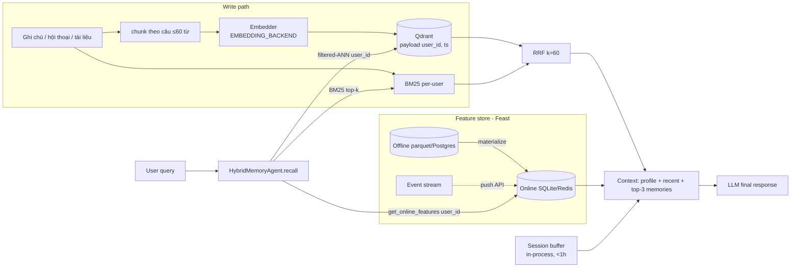

# Bonus — Hybrid Memory cho trợ lý AI cá nhân (tiếng Việt)

**Tác giả:** Nguyễn Thị Hạ — 2A202602536 · A20-K4
**Code:** [`agent.py`](agent.py) (`HybridMemoryAgent.remember()` / `.recall()`) ·
[`demo.py`](demo.py) (5 query, `python bonus/demo.py` exit 0)

Trợ lý cần nhớ ba thứ có **vòng đời khác nhau**:

- **Ký ức** (hội thoại, tài liệu đã đọc, ghi chú). Tăng liên tục, được truy vấn
  bằng ngôn ngữ tự nhiên.
- **Profile ổn định** (ngôn ngữ, tốc độ đọc, chủ đề yêu thích). Thay đổi theo
  tuần.
- **Hoạt động gần đây** (vừa hỏi gì, hỏi bao nhiêu). Thay đổi theo giây.

Ba vòng đời này đi vào ba chỗ lưu riêng, rồi được ghép lại ở bước dựng ngữ cảnh.

## Sơ đồ kiến trúc



Dạng ASCII (khi không render được Mermaid):

```
 write: text ─► chunk ─► embed ─► Qdrant(user_id) ──┐
                     └─► BM25(user_id) ─────────────┤
 read : query ─► Feast online(user_id) ─────────┐   ├─► RRF(k=60) ─► top-3
                 session buffer (<1h) ──────────┼───┴──────────────────┐
                                                └─► assemble context ◄─┘ ─► LLM
```

## Quyết định 1 — Chunking: gom theo câu, tối đa ~60 từ

**Các phương án:** (a) mỗi tin nhắn là một chunk; (b) cả cuộc hội thoại là một
chunk; (c) gom các câu liền nhau cho tới khi chạm ~60 từ, không bao giờ cắt
giữa câu. **Chọn (c).**

**Tradeoff:**
- **(a)** cho chunk quá ngắn. Câu "ừ, cái đó" không mang nghĩa khi đứng riêng,
  nên embedding gần như ngẫu nhiên và chiếm chỗ trong top-k.
- **(b)** giữ đủ ngữ cảnh nhưng trộn nhiều chủ đề vào một vector. Đây đúng là
  vấn đề "embedding câu ghép rơi vào khoảng giữa hai cụm" đã đo ở NB6 (single-shot
  chỉ đạt balance 0.08). Nó còn ăn context window: 3 chunk cỡ cả hội thoại có
  thể tới hàng nghìn token.
- **(c)** giữ trọn một ý, mỗi chunk chỉ vài chục token. 3 chunk đưa vào LLM tốn
  dưới 300 token. Cái giá là số vector nhiều hơn (b) khoảng 5–10 lần, tức tốn
  dung lượng lưu trữ hơn. Với một người dùng cá nhân thì chỉ cỡ vài chục nghìn
  vector, nên chấp nhận được.

Con số 60 từ là ước lượng, chưa phải giá trị tối ưu. Bước tiếp theo nên là quét
40/60/120 từ trên một golden set ký ức thật, giống cách NB7 quét ngưỡng cache
thay vì copy con số 0.75.

## Quyết định 2 — Feature schema: feature dạng bảng, không dùng embedding feature

Profile dùng lại 2 feature view của NB4:

| Feature | Entity | TTL | Nguồn | Lý do |
|---|---|---|---|---|
| `topic_affinity`, `preferred_language`, `reading_speed_wpm` | `user` | 30 ngày | batch hằng ngày | thay đổi chậm; TTL dài để user ít hoạt động vẫn có profile |
| `queries_last_hour`, `distinct_topics_24h` | `user` | 1 giờ | stream / push | để quá 1 giờ thì giá trị không còn ý nghĩa; hết TTL thì trả `None` và agent in `n/a` |

**Tradeoff:** cách khác là học một vector "sở thích ẩn" từ lịch sử (embedding
feature, họ thứ 6 ở NB8). **Mình chọn dạng bảng** vì 3 lý do:

1. Đọc được và debug được. "likes cloud" giải thích được cho người dùng; một
   vector 384 chiều thì không.
2. Không phải embed lại. Đổi embedding model sẽ làm mọi embedding feature cũ mất
   giá trị, giống như phải xoá sạch semantic cache ở NB7.
3. Chủ đề vốn đã là feature dạng categorical. Phần ngữ nghĩa thì vector store đã
   lo.

Embedding feature chỉ đáng thêm khi có đủ tương tác để xếp hạng gợi ý. Lúc đó nó
nên là feature view thứ ba, không thay thế các feature hiện có.

## Quyết định 3 — Freshness: mỗi use case một mức

| Use case | Mức freshness | Cơ chế |
|---|---|---|
| "Tôi vừa hỏi gì?" (hội thoại đang diễn ra) | dưới 1 giây | session buffer trong process (`_recent`), không đi qua Feast |
| Ký ức mới (vừa đọc xong một tài liệu) | vài giây | `remember()` upsert thẳng vào Qdrant; không có batch ở giữa |
| `queries_last_hour` | khoảng 1 phút | stream → Feast push API (lab chạy batch materialize; production nên dùng Kafka như ghi chú trong demo) |
| `topic_affinity`, tốc độ đọc | hằng ngày | batch + `materialize-incremental` |

**Tradeoff:** đẩy mọi thứ lên streaming thì đơn giản về khái niệm, nhưng tốn hạ
tầng (Kafka/Flink chạy 24/7) cho những feature mà hằng ngày là đủ. Ngược lại,
chỉ dùng batch thì trợ lý trả lời "tôi không nhớ" về tài liệu người dùng vừa đọc
5 phút trước. Đây là lỗi người dùng thấy ngay. Tách theo vòng đời thì chỉ phần
cần nhanh mới phải trả chi phí streaming.

## Phương án bị loại

**Mình đã cân nhắc lưu ký ức ngay trong feature store** (embedding feature view
theo `user_id`) để chỉ phải vận hành một hệ thống. **Đã loại** vì:

- Feature store trả về giá trị theo entity key, không làm được ANN. Muốn top-k
  ngữ nghĩa thì vẫn phải kéo hết vector của user về rồi tự tính cosine.
- Ký ức mới đến mỗi phút, còn profile thay đổi theo tuần. Ghép chung thì hai
  vòng đời này bị buộc vào cùng một lịch materialize.

**Cũng đã loại** việc lọc user bằng post-filter trên index chung. NB5 cho thấy
post-filter sập recall (0.00 ở độ chọn lọc 3.8%). Tệ hơn, bỏ sót một câu lệnh
lọc là rò dữ liệu giữa các user, đúng như demo leak ở NB7. Agent dùng
**filtered-ANN** theo `user_id`, và `demo.py` có assert để kiểm tra điều này.

## Lưu ý riêng cho người dùng Việt Nam

- **Trộn Việt–Anh:** "summary cloud security", "Recommend đọc gì tiếp". BM25
  bắt được thuật ngữ tiếng Anh nguyên văn, vector bắt được phần diễn đạt. Đây là
  lý do dùng hybrid (NB2: hybrid đạt 100% trên loại `mixed`).
- **Embedding model:** `bge-small-en` yếu với câu tiếng Việt diễn đạt lại. NB2
  đo được 24% trên loại paraphrase, và trong demo, query 4 ("tự động mở rộng hạ
  tầng") chỉ xếp ghi chú HPA ở hạng 2. Production nên dùng `EMBEDDING_BACKEND=bge-m3`
  (agent đọc biến này qua `app.embeddings`, không phải sửa code; đổi model thì
  phải index lại).
- **Tách từ:** đang tách theo khoảng trắng, nên "đám mây" bị thành 2 token. Có
  thể dùng `pyvi`/`underthesea` để tách từ ghép chuẩn hơn, nhưng chậm hơn và
  thêm dependency. Với ký ức cá nhân (ít doc, ít token hiếm) thì whitespace tạm
  đủ. Nên đo lại khi thêm dấu/bỏ dấu ("may chu" so với "máy chủ"), loại lỗi gõ
  phổ biến ở Việt Nam.
- **Nghị định 13/2023 về dữ liệu cá nhân:** ký ức là dữ liệu cá nhân. Cần có
  quyền xoá theo `user_id` (Qdrant hỗ trợ `delete` theo filter), đồng ý trước
  khi lưu, và không đẩy ký ức vào semantic cache dùng chung.

## Hạn chế của POC này

- Qdrant chạy in-memory nên khởi động lại là mất hết ký ức.
- Chưa có CRUD cho từng ký ức (sửa/xoá một ghi chú cụ thể), chưa có cơ chế làm
  phai ký ức cũ theo thời gian, và chưa gộp các ký ức trùng nhau.
- Phân tách user dùng metadata filter, tức là isolation mềm. Dữ liệu nhạy cảm
  nên tách collection hoặc tenant riêng, có mã hoá at-rest.
- `queries_last_hour` lấy từ dữ liệu tổng hợp của NB4, chưa được nối với hành vi
  thật của agent. Streaming push chỉ dừng ở mức thiết kế.
- Chưa gọi LLM và chưa có golden set để đo chất lượng recall. Kết quả trong demo
  chỉ là đánh giá định tính.
